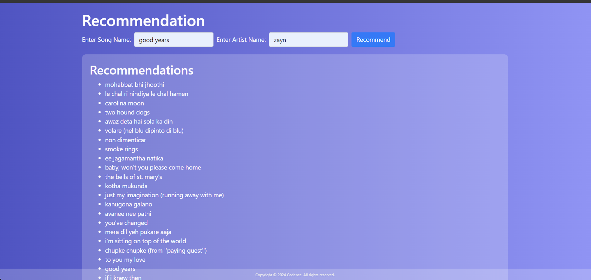
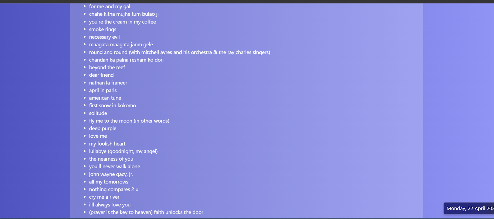

# Cadence

Cadence utilizes the Spotify API to gather information about songs and provide song recommendations based on user input. It includes s fetching song details, extracting audio features, data preprocessing, content-based filtering, and K Nearest Neighbors (KNN) recommendation algorithms.

## Usage

1. Run the main script:
   `python app.py`
2. Follow the prompts to input the name of a song and its artist.
3. The system will provide 20 recommendations based on the input song using a combination of content-based filtering and KNN algorithms.

## Screenshots

